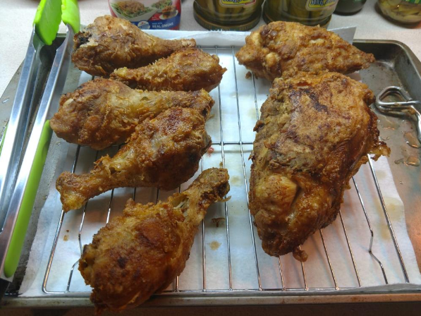

# Rosemary-Brined Fried Chicken

> **Takeaway:** A long overnight brine, a peppery seasoned coating, and a slow fry create juicy chicken with a crisp, flavorful crust. Inspired by the Food Network's *The Best I Ever Ate* episode, **"Deep Fried Decadence."**


Note:
```
I made this based on the "Best I ever had" TV episode called "Deep Fried Decadence" from the Food
network. I found it on demand with the Philo streaming app.
I don’t have an exact recipe, so I will do my best to explain.
```

## Overview

This fried chicken relies on two important steps:

1. An overnight herb-and-spice brine that keeps the chicken incredibly moist.
2. A long rest after breading that helps the coating adhere and fry up crisp and flavorful.

The result is chicken that's juicy inside, crispy outside, and packed with savory seasoning.

---

## Ingredients

### For the Brine

- About 1.5 gallons cold water
- 3/4 cup kosher salt or sea salt
- 3/4 cup granulated sugar
- 1 tbsp paprika
- 1 tbsp crushed red pepper
- 4 fresh rosemary sprigs
- 6–8 fresh bay leaves
- 1/2 cup whole black peppercorns

### For the Chicken

- 1 whole fryer chicken, cut into pieces
  - or about 4–5 lbs of assorted chicken pieces

### For the Breading

- 1 1/2 cups all-purpose flour
- 1/4 cup cornstarch
- 1/3 cup black pepper
- 1/3 cup paprika
- 1/3 cup salt

### For Frying

- Vegetable oil, peanut oil, or canola oil

---

## Equipment

- 2.5-gallon food-safe container with lid
- Large mixing bowl
- Sheet pan or tray
- Large Dutch oven, deep fryer, or heavy pot
- Thermometer recommended

---

## Step 1: Prepare the Brine

In a large container combine:

- Water
- Salt
- Sugar
- Paprika
- Red pepper
- Rosemary
- Bay leaves
- Peppercorns

Mix thoroughly until the salt and sugar dissolve.

Add the chicken pieces and ensure they are fully submerged.

Cover and refrigerate overnight.

### Brining Time

```text
8–24 hours
```

The longer brine allows the chicken to absorb flavor while remaining juicy during frying.

---

## Step 2: Prepare the Breading

In a large bowl combine:

- Flour
- Cornstarch
- Black pepper
- Paprika
- Salt

Mix thoroughly until evenly blended.

The cornstarch helps create a lighter, crispier crust.

---

## Step 3: Bread the Chicken

Remove the chicken from the brine.

Shake off excess liquid but do not rinse.

Coat each piece thoroughly in the seasoned flour mixture.

Place the breaded chicken on a tray or sheet pan.

### Refrigerate Again

Return the coated chicken to the refrigerator for approximately:

```text
6 hours
```

This drying and resting period helps the breading adhere to the chicken and improves crispness during frying.

---

## Step 4: Fry the Chicken

Heat oil to approximately:

```text
275°F (135°C)
```

Carefully lower the chicken into the hot oil.

Avoid overcrowding the fryer.

Cook until:

- Golden brown
- Crispy
- Fully cooked through

Approximate cooking time:

```text
20 minutes
```

Actual time will vary depending on the size of the chicken pieces.

### Internal Temperature

For food safety, the thickest part of the chicken should reach:

```text
165°F (74°C)
```

---

## Step 5: Rest Before Serving

Transfer finished chicken to a wire rack or paper towel-lined tray.

Allow it to rest for several minutes before serving.

This helps preserve the crust while allowing juices to redistribute.

---

## Why This Method Works

### Overnight Brine

The salt, sugar, herbs, and spices:

- Season the meat throughout
- Improve moisture retention
- Add subtle herb flavor

### Cornstarch in the Coating

Cornstarch helps create:

- More crunch
- Better browning
- A lighter crust

### Refrigeration After Breading

Allowing the breaded chicken to rest:

- Improves coating adhesion
- Reduces breading loss during frying
- Creates a more consistent crust

---

## Optional Upgrades

### Extra Heat

Add:

- Cayenne pepper
- Cajun seasoning
- Additional crushed red pepper

to the breading mix.

### Southern Style

Serve with:

- Mashed potatoes
- Cream gravy
- Biscuits
- Green beans

### Texas Style

Pair with:

- Jalapeños
- Potato salad
- Baked beans
- Sweet tea

---

## Serving Suggestions

This fried chicken pairs especially well with:

- Homemade potato salad
- Coleslaw
- Corn on the cob
- Macaroni and cheese
- Biscuits
- French fries

---

## Greg's Tip

> The overnight brine is the secret. Most fried chicken gets seasoned on the outside. This method seasons the meat all the way through, keeping it flavorful and juicy long after it comes out of the fryer.
