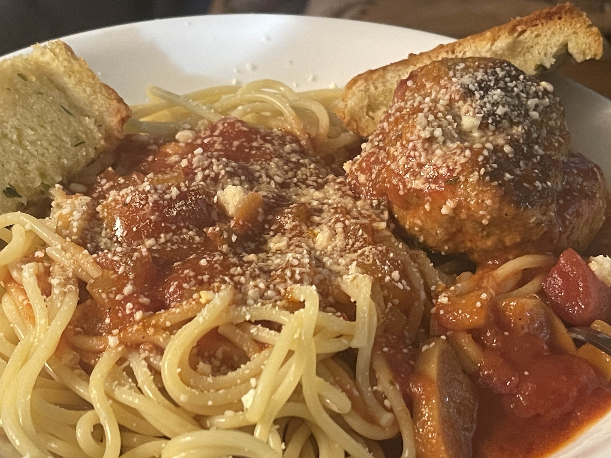

# Spaghetti & Meatballs

> **Takeaway:** The secret isn't the pasta—it's the meatballs. A simple blend of beef, breadcrumbs, Parmesan, and egg simmered low and slow in tomato sauce creates tender, flavorful meatballs that taste like they've been cooking all day.


## Overview

This recipe focuses on traditional homemade meatballs simmered for hours in tomato sauce. The long cook time allows the meatballs to absorb the flavor of the sauce while keeping the inside tender and juicy.

The result is a hearty, family-style spaghetti dinner that pairs perfectly with garlic bread and feeds a crowd.

## Ingredients

### For the Meatballs

- 1 lb ground beef (90% lean preferred)
- 1 cup seasoned breadcrumbs
  - Italian-style or Garlic & Herb work well
- 1/2 cup grated Parmesan cheese
  - Kraft-style grated Parmesan from the shaker container
- 1 large egg

### For the Sauce

- 2 quarts tomato sauce
  - Classico Tomato & Basil is a favorite choice
- About 1/2 jar water (use the empty sauce jar to measure)

### For Serving

- 1 box Barilla Thin Spaghetti
- Frozen garlic bread (Pepperidge Farm recommended)

## Meatball Method

### 1. Build the Meatball Mixture

In a large mixing bowl combine:

- Breadcrumbs
- Parmesan cheese

Mix thoroughly.

Add:

- Egg

Mix again. The mixture will seem very dry at first.

Add the ground beef.

### 2. Mix Thoroughly

Using a stand mixer or clean hands, knead the mixture until:

- The ingredients are evenly distributed.
- No large clumps remain.
- The meat mixture feels uniform throughout.

Do not overwork the meat, but make sure everything is fully incorporated.

### 3. Form the Meatballs

Using a tablespoon as a guide:

- Standard size: about 2 tablespoons per meatball
- Extra hearty size: up to 3 tablespoons per meatball

Roll each portion into a firm ball and place on a plate or tray.

## Browning the Meatballs

### 4. Brown Slowly

Heat a large skillet over **medium-low to medium heat**.

Place all of the meatballs into the pan.

Using tongs, rotate the meatballs approximately every 90 seconds so they cook evenly on all sides.

The goal is to:

- Develop color
- Build flavor
- Hold the meatballs together

Do not fully cook them through at this stage.

### 5. Transfer to Sauce

Once the meatballs are browned on most sides:

Transfer them carefully into a large stockpot.

Add:

- 2 quarts tomato sauce
- About 1/2 jar water

Stir gently.

## Slow Simmer Method

### 6. Begin Cooking

Start at approximately **one-third heat**.

After about **45 minutes**, reduce the heat to a gentle simmer.

### 7. Simmer Low and Slow

Cook for a **minimum of 4 hours**.

The long simmer allows:

- The sauce to deepen in flavor.
- The meatballs to become exceptionally tender.
- The beef, cheese, and tomato flavors to fully meld.

Stir occasionally and keep the simmer gentle.

## Pasta & Bread

### Thin Spaghetti

Cook one full box of:

```text
Barilla Thin Spaghetti
```

according to package directions.

The box may claim 8 servings, but for this amount of sauce and meatballs it works well as approximately 4 generous portions.

### Garlic Bread

Prepare frozen garlic bread according to package instructions.

## Troubleshooting

### Meatballs Too Firm?

Reduce the breadcrumbs from:

```text
1 cup
```

to:

```text
2/3 cup
```

This creates a softer meatball with a more tender texture.

### Sauce Too Thick?

Add a little additional water during the simmer.

### Sauce Too Thin?

Continue simmering uncovered until it reaches the desired consistency.

## Optional Upgrades

### Extra Flavor

Add one or more of:

- Fresh garlic
- Chopped parsley
- Italian seasoning
- Crushed red pepper

### Richer Sauce

Add:

- A splash of red wine
- A spoonful of tomato paste
- A Parmesan rind while simmering

### Bigger Meatballs

Use 3 tablespoons of mixture per meatball for a steakhouse-style presentation.

## Serving Notes

Serve the spaghetti topped generously with:

- Extra sauce
- Several meatballs
- Additional grated Parmesan

Pair with:

- Garlic bread
- Caesar salad
- Red wine or iced tea

The leftovers often taste even better the next day after the flavors have had more time to develop.

> **Greg's Tip:** Don't rush the simmer. The long, gentle cook is what transforms a simple meatball into a restaurant-quality meatball.
